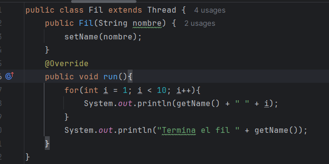
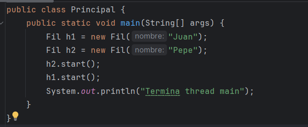
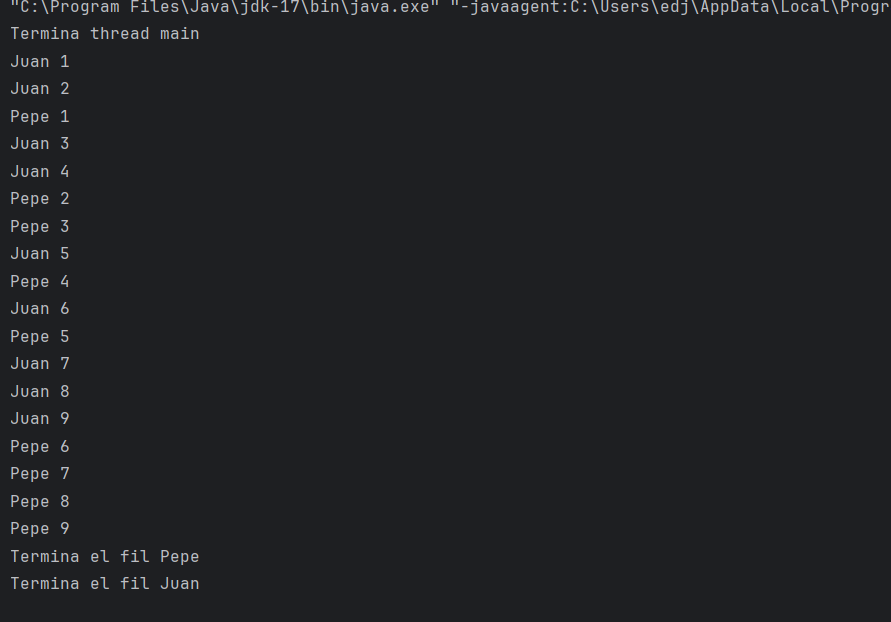
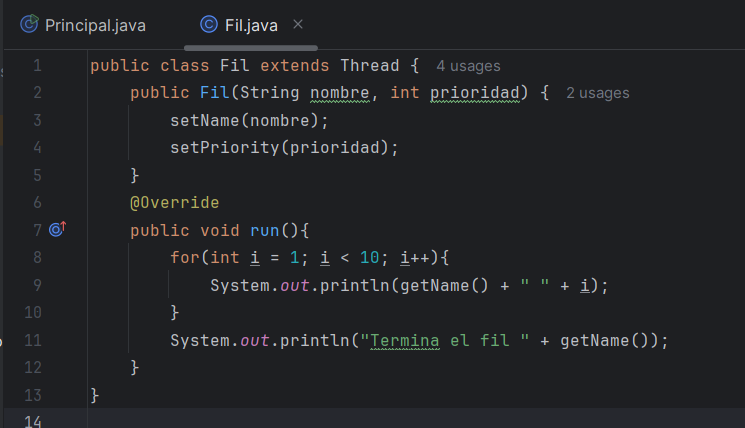
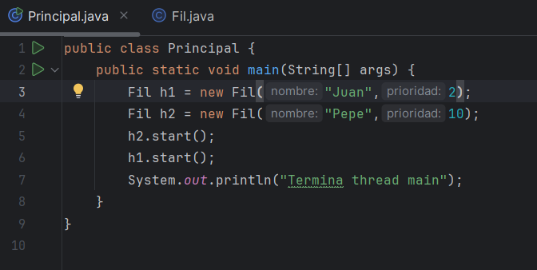
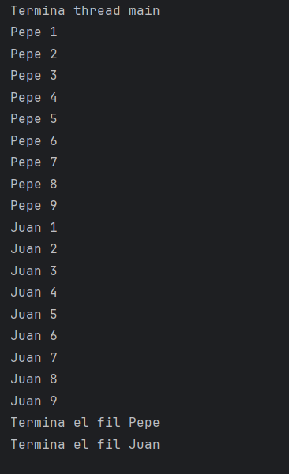
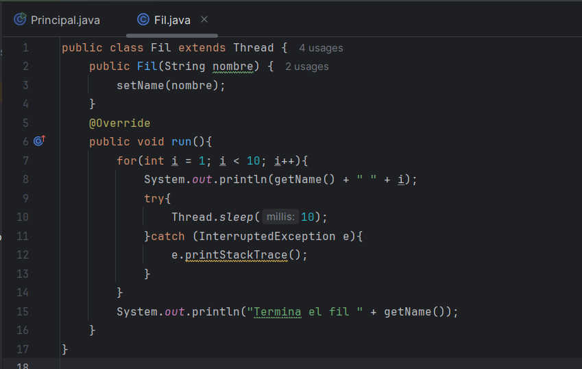
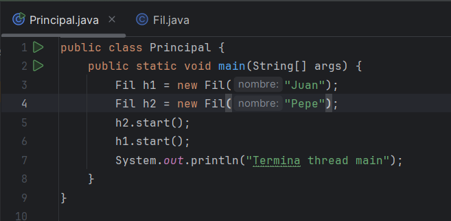
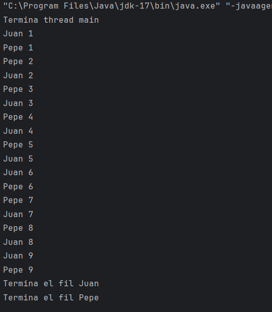

<h1>01-fils</h1>
<h3>Juan y Pepe intercalándose de forma equitativa</h3>
<ul>
    <li>
        Fil.java 
         
        Creo la clase fil, a la cual extiendo de la clase Threads para utilizar sus métodos. Después, creo un constructor que inicializo con una variable de tipo String, y cambio el nombre del hilo dentro del constructor con el método setName(). Por último, itero 10 veces con un bucle for e imprimo el iterador.
    </li>
    <li>
        Principal.java 
         
        Creo dos objetos de tipo fil y utilizo el método start() para iniciar ambos hilos.
    </li>
    <li>
        Salida 
        
    </li>
<ul>

<h3>Pepe se ejecuta antes que Juan</h3>
<ul>
    <li>
        Fil.java 
         
        Añado otro atributo al constructor de la clase Fil.java: el atributo prioridad, el cual utilizaré para cambiar la prioridad por defecto del hilo a la deseada con el método setPriority().
    </li>
    <li>
        Principal.java 
         
        En la clase principal, inicializo el hilo llamado pepe con mayor prioridad para que, de este modo, sus procesos terminen antes que los de Juan.
    </li>
    <li>
        Salida 
        
    </li>
<ul>

<h3>Pepe y Juan se ejecutan en un orden alterno y específico.</h3>
<ul>
    <li>
        Fil.java 
         
            En la clase Fil, utilizo el método sleep() para pausar el hilo que se está ejecutando durante 10 milisegundos. De esta forma, consigo que el otro hilo, el que no está dormido, prosiga con su ejecución. A todo este proceso, le añado un catch con la excepción InterruptedException, ya que es posible que se lance esta excepción si otro hilo interrumpe mientras este está en pausa.
    </li>
    <li>
        Principal.java 
         
        La clase Principal no sufre ningún cambio.
    </li>
    <li>
        Salida 
        
    </li>
<ul>

