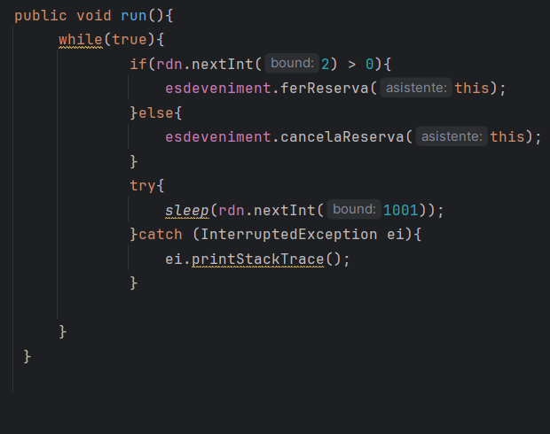
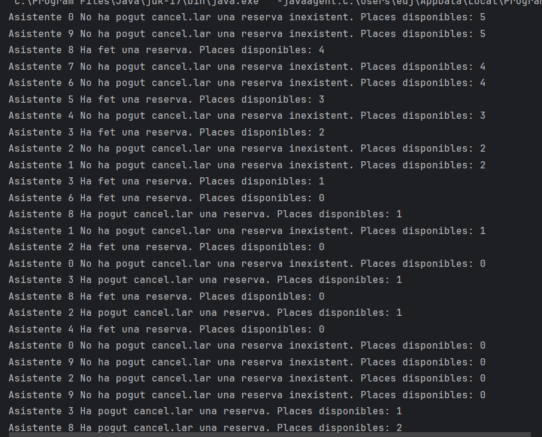
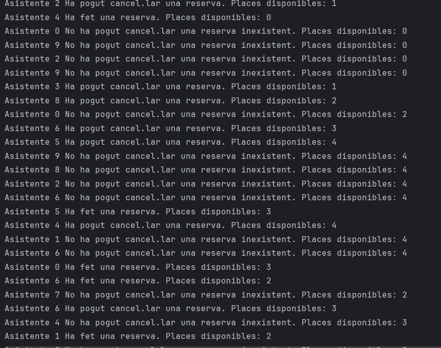
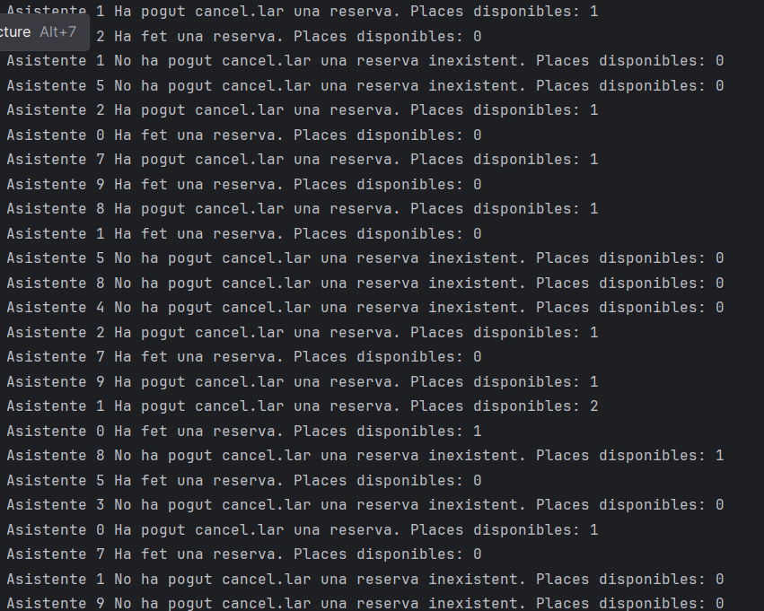
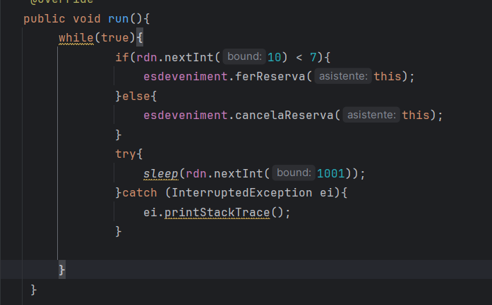
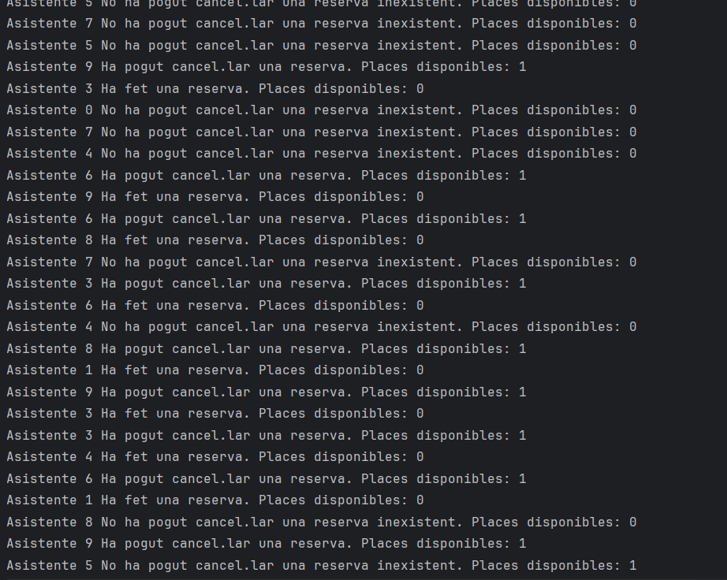
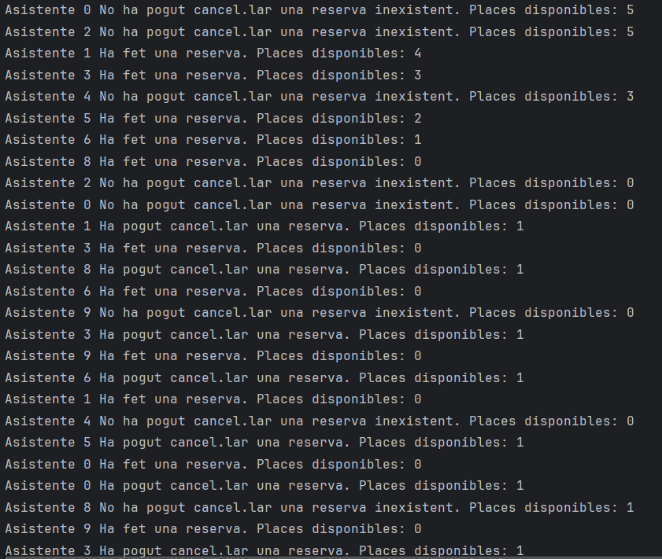
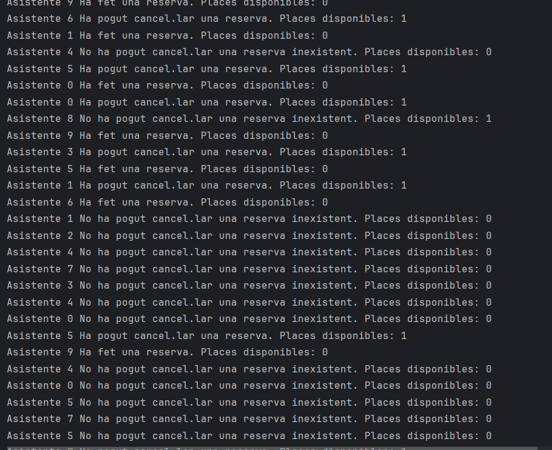

</b>1.Per què s'atura l'execució al cap d'un temps? </b>
    Cuando se han hecho todas las reservas y los asistentes siguen intentándolo, acaba sucediendo que, por probabilidad, todos los asistentes restantes intenten hacer una reserva, quedando en espera y sin posibilidad de que otro hilo llame al método notifyAll().   

2.Què passaria si en lloc d'una probabilitat de 50%-50% fora de 70% (ferReserva)-30% (cancel·lar)? I si foren al revés les probabilitats? → Mostra la porció de codi modificada i la sortida resultant en cada un dels dos casos.</b> 

-Porcetanje 50%-50% 

 

-Porcetanje 70%-30%
 
 

 

Al aumentar el porcentaje de reservas, el código presenta mayores posibilidades de quedarse sin reservas, dejando a todos los asistentes en espera  

</b>3.Per què creus que fa falta la llista i no valdria només amb una variable sencera de reserves?</b> 

Sin la lista, sería imposible llevar un control de las cancelaciones, ya que desconoceríamos quiénes son los dueños de las reservas.
